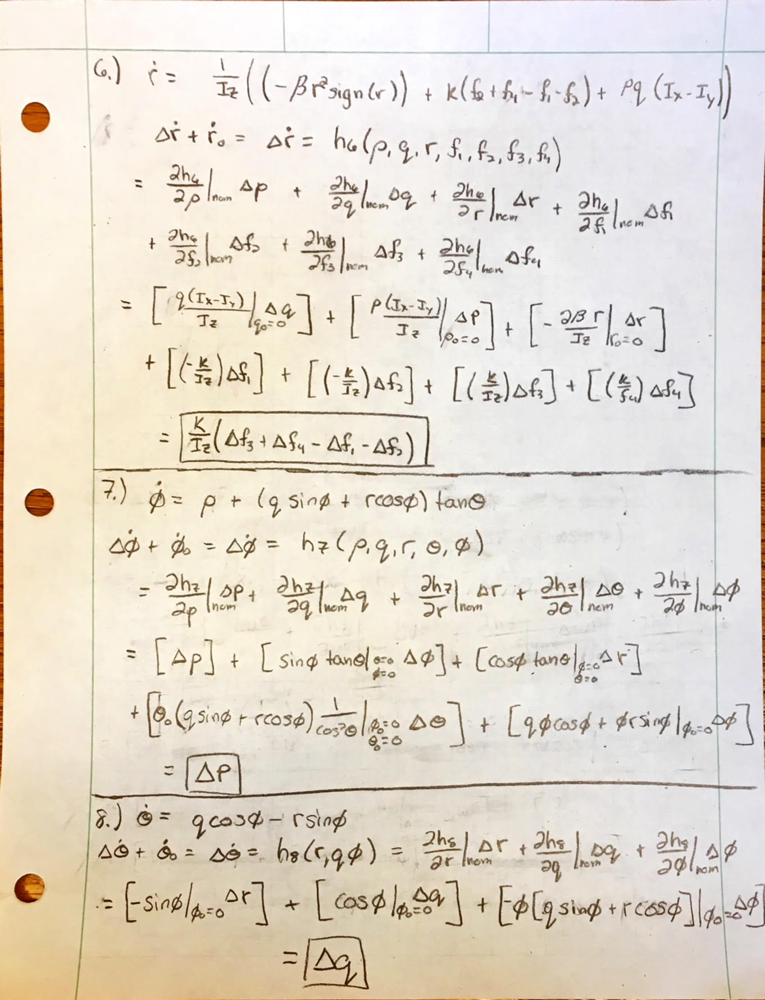

# Aircraft Dynamics 3

# Purpose:
Create a linearized model to simplify equations of motion for a Rolling Spider quad-copter. The assumption is that higher order terms will have inherently lower associated error terms. This linearized model will then be compared to the non-linearized model about varying deviations to the quad-copters state and simulated using a numerical ordinary differential equation solver in MATLAB. The linearized model will then be used to calculate the derivative control gain and this gain will be inputted into the quad-copters control loop to see how these gains improve the copter's stability. 
  

# Question 1: Linearized Model about a Steady Hover Trim State:

  

  

  

  

  

# Questions 2 & 3: Non-Linear Model Vs. Linear Model:

## Part a.) Deviation of +5 $^{\circ}$ Bank:
 
   

## Part b.) Deviation of +5 $^{\circ}$ Pitch:
 
   

## Part c.) Deviation of +5 $^{\circ}$ Azimuth:
 
   

## Part d.) Deviation of $+ 0.1 \frac{rad}{s}$ Roll Rate:

  

   

## Part e.) Deviation of $+ 0.1 \frac{rad}{s}$ Pitch Rate:

  

   

## Part f.) Deviation of $+ 0.1 \frac{rad}{s}$ Yaw Rate:

  

   

## Question 2 Analysis:

After analyzing the plots, the results make sense. The quad copter did not change its position with changes in azimuth or yaw rate, which is what is expected as the copter is in steady hovering flight. Since the body is hovering- the body's z-axis is perpendicular to the ground (the inertial x-y plane). This means that changes in the azimuth and yaw rate only change the attitude and not its position since the forces from both gravity and the motors act in the z axis, where the z-axis doesn't not change orientation. Changes in the pitch rate, roll rate, Bank angle, and Pitch angle, however, do change the orientation of the z-axis. This gives the motors forces acting in the z-axis of the body components in the x and y inertial directions. Where the copter was in steady flight before, this change causes a force in balance as the force of the motors now only has components opposing gravity. With a smaller force acting to oppose gravity the copter descends in the positive D-direction with motion in the - N direction for positive changes in pitch and pitch rate and in the positive E-direction for positive changes in roll rate and bank. This shows how even small perturbations change the condition of the copter in steady hover, meaning a hovering state is unstable.
   

## Question 3 Analysis:
When comparing variations in parameters of the linear model to the non-linear model the similarities are strikingly similar. For all translational cases the trajectories mirrored closely for linear and non-linear models. The variations in the bank, pitch, and azimuth were seen to be nearly identical for all cases. Lastly the angular rates were also nearly identical. The variations seem extreme on the graphs, however this is only due to the scale being in the thousandths of radians per second. Showing there there are small differences, however the linear model is accurate especially for the small deviations that we implemented for our analysis.
   

# Feedback Control:

## Deviation of $+ 0.1 \frac{rad}{s}$ Roll Rate:

  

   

## Deviation of $+ 0.1 \frac{rad}{s}$ Pitch Rate:

  

   

## Deviation of $+ 0.1 \frac{rad}{s}$ Yaw Rate:

  

   

When a feedback control is implemented on the rotational rates, the trajectory of the cases with deviations in their initial roll and pitch rates reduces drastically. The feedback controls the rate at which the copter rotates, slowing the roll rate to zero in less than 0.2 seconds. This in turn had an effect of correcting the path of the copter so that it changes position much less. For the case where the yaw rate was changed, the copter still did not displace any distance as it stays fixed about its z-axis in body coordinates. The plots of the yaw rate and azimuth as a function of time shows how the control stops its rotation about this body fixed z axis, even though it has no effect on position it still had an effect on the attitude of the copter.
   

## Rotational Motion Comparison:

 With Control Feedback 

 Without Control Feedback 

  

## Translational Motion Comparison:

 With Control Feedback 

 Without Control Feedback 

 

As can be seen from the data the rolling spider's flight lasted much longer after the control law was turned off and the derivative control law was turned on. The effect of having the variations in roll rate, pitch rate, and yaw rate controlled by a feedback showed to keep the angular position and angular rates under control for much longer, as the flight time is seen to last near 13 seconds in comparison to the case that did not have the feedback control lasting roughly 8 seconds. It can also be seen that after the complete control law was turned off the derivative control's inputs actually caused the attitude to 'teeter' back and forth for a moment, improving the stability and thus the time of flight. The feedback control did help with longer flight, however, was limited as the it only corrects changes in rates while proportional control is needed to control changes in positions and attitude (directly at least).  